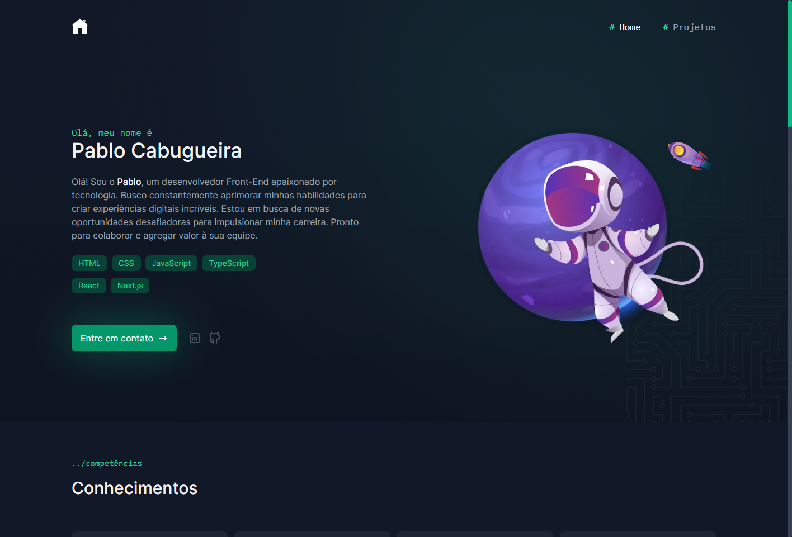

<h1 align="center"> Bitcent </h1>

  <a href="#-tecnologias">Tecnologias</a>&nbsp;&nbsp;&nbsp;|&nbsp;&nbsp;&nbsp;
  <a href="#-projeto">Projeto</a>&nbsp;&nbsp;&nbsp;|&nbsp;&nbsp;&nbsp;
  <a href="#memo-licença">Licença</a>

  

 

  

## 🚀 Tecnologias

Esse projeto foi desenvolvido com as seguintes tecnologias:

- Next.js
- React
- TypeScript
- Tailwind CSS
- Git e Github

## 💻 Projeto

Meu portfolio online - uma vitrine dos meus projetos e habilidades. Explore minha jornada criativa e descubra minha paixão por design e inovação. Bem-vindo a um mundo de criatividade e dedicação 🙂

- [Visite o projeto online](https://pablo-portfolio-eta.vercel.app)

## :memo: Licença

Esse projeto está sob a licença MIT.

---

Feito com ♥ by Pablo Galvão Cabugueira :wave: